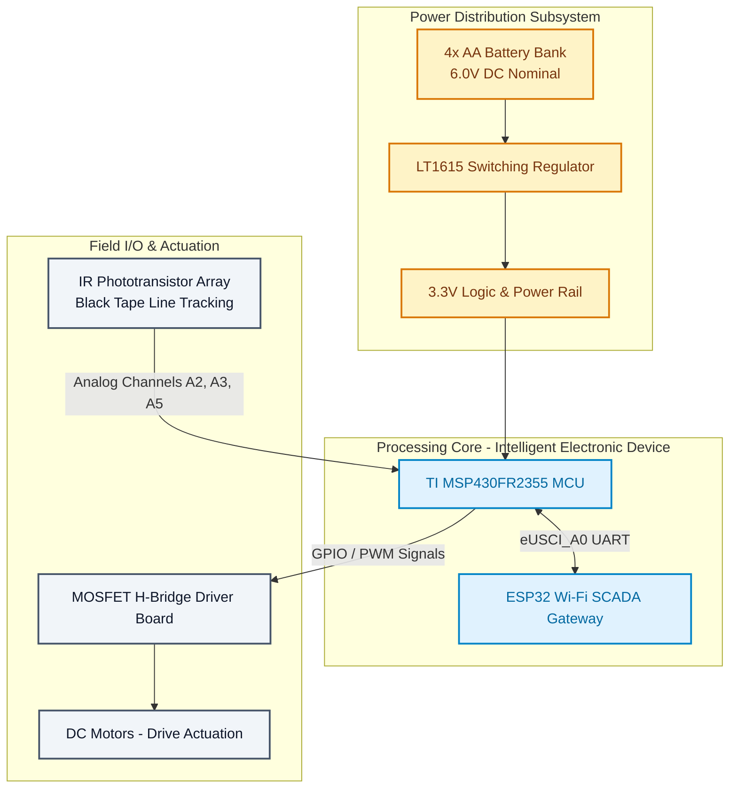
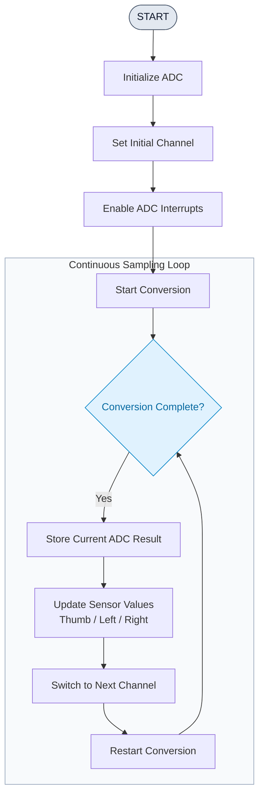
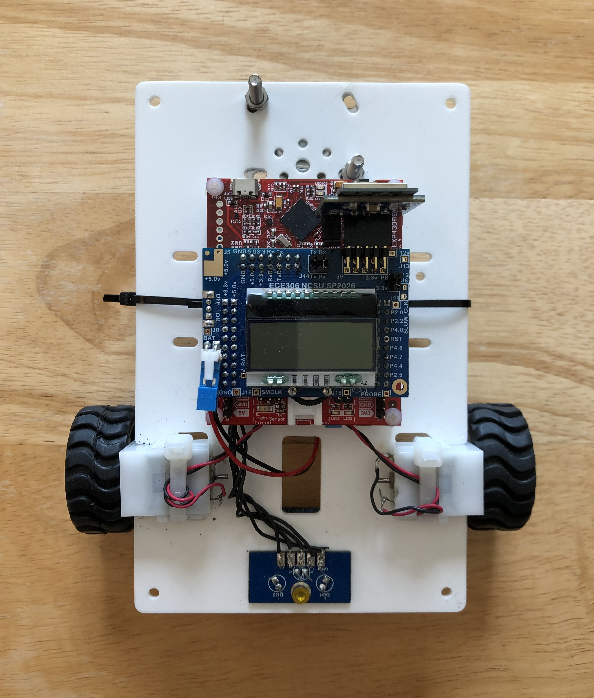
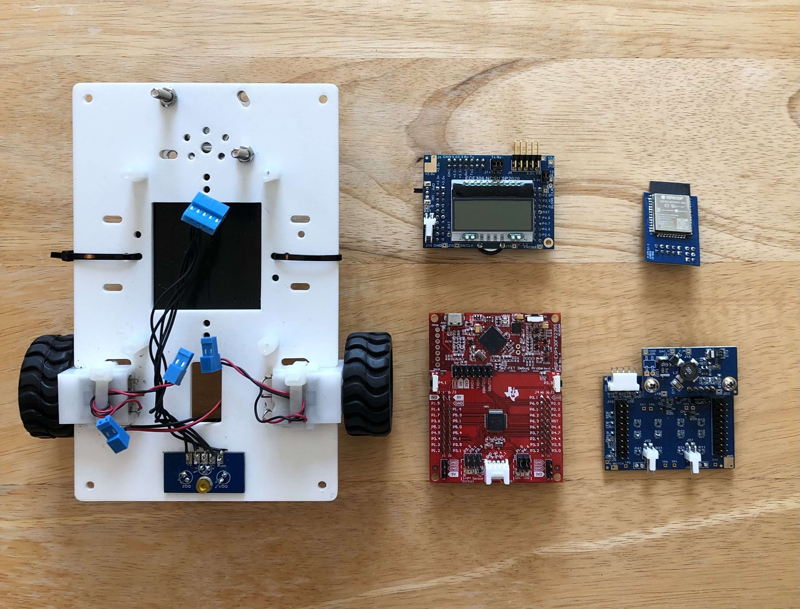
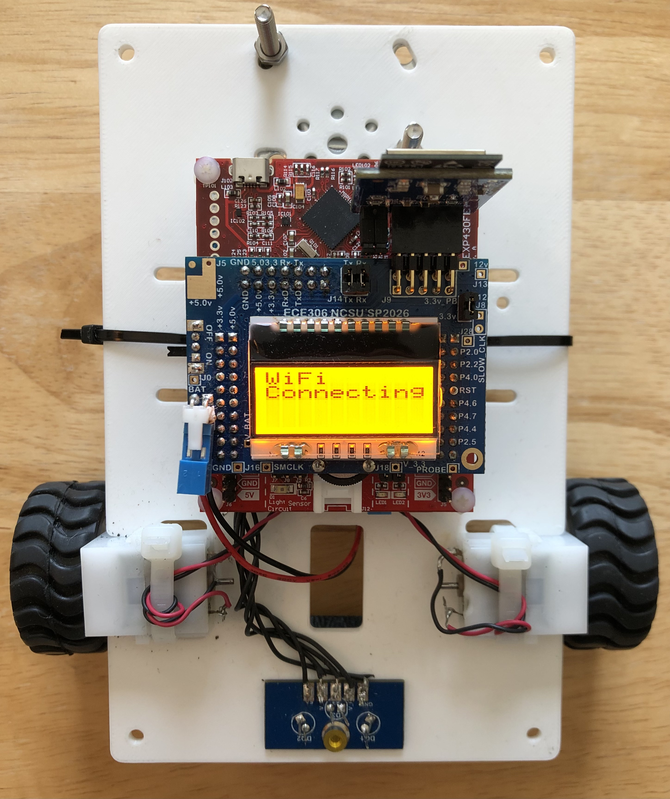
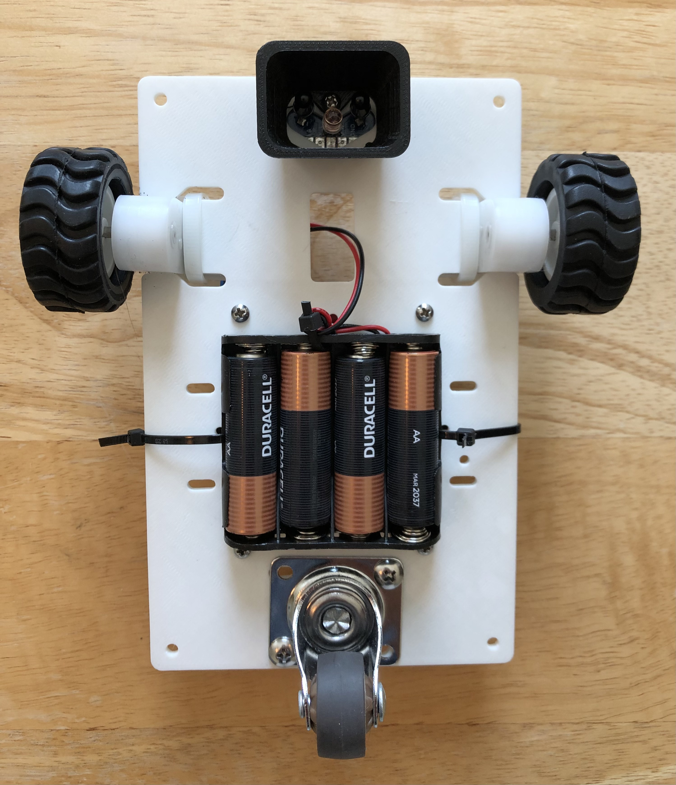

# MSP430 WiFi Autonomous Car

A real-time, microcontroller-based closed-loop control system built on the **TI MSP430FR2355 MCU**. Designed as an **autonomous line-following vehicle**, the car uses an array of infrared (IR) phototransistors to continuously monitor surface reflectivity and navigate a course by tracking a **black line of electrical tape**. 

The system integrates multi-channel analog signal acquisition, deterministic timer interrupt scheduling, dual eUSCI UART ring-buffer wireless telemetry via an ESP32 Wi-Fi module, and dynamic power management.

> **Power Systems & P&C Engineering Relevance:** Although implemented as a mobile robotic vehicle, this architecture directly mirrors the design of an **Intelligent Electronic Device (IED) / Digital Protective Relay**. It continuously polls analog sensor channels (analog input sampling), processes decision logic via deterministic finite state machines (protection logic), controls high-current switching hardware via MOSFET drivers (circuit breaker tripping/actuation), and relays status telemetry over a remote TCP/IP link (SCADA gateway).

---

## 🛠️ P&C Engineering Functional Mapping

| Embedded Hardware / Software Feature | Power Systems & P&C Application Equivalent |
| :--- | :--- |
| **MSP430FR2355 MCU & FRAM Memory** | **Intelligent Electronic Device (IED)** handling real-time deterministic execution and non-volatile event storage. |
| **ESP32 Wi-Fi Module (eUSCI UART)** | **SCADA / Substation Gateway** managing secure remote command parsing and telemetry packet transport. |
| **10/12-bit ADC & IR Phototransistors** | **Analog Signal Conditioning (CT/PT Inputs)** monitoring line parameters and detecting contrast transitions across the course line. |
| **MOSFET H-Bridge Driver Board** | **Breaker Control & Output Tripping Logic** translating low-power MCU logic into high-current DC motor switching. |
| **Timer Interrupts (`Timer0_B0`) & FSM** | **Automated Scheme Logic & Interlocking** maintaining non-blocking, time-synchronized steering control loops. |

---

## 📐 System Architecture & Hardware Design



### 1. DC Power Subsystem & Efficiency Analysis
* **Primary Source:** 6.0V DC nominal supply (4x 1.5V AA battery bank).
* **Regulation:** Board-level LT1615 switching converters step voltage down to a stabilized 3.3V logic bus (`PWR3_3`).
* **Power Load Profile:**
  $$\text{Usable Capacity} \approx 6.0\text{V} \times 2.0\text{Ah} \times 0.85 = 10.2\text{Wh}$$
  Under maximum drive load (~10W total system draw with LCD backlight and high-current motor actuation), continuous operational endurance is calculated at approximately **1.0 hour**.

### 2. Sensor Signal Processing & Line Navigation
The optical sensing array utilizes IR emitter diodes paired with phototransistors mounted to the front underside of the chassis. As the vehicle crosses between white floor tiles and the **black electrical tape track**, voltage drops are digitized using the MSP430's integrated ADC on pins `A2`, `A3`, and `A5`:
* **Sampling Rate Optimization:** Driven by `Timer_B1` interrupts operating on a 20 ms polling cycle to eliminate missed line-crossing events at full speed.
* **Filtering:** Raw 12-bit ADC values (0–4095) are scaled and filtered to maintain reliable detection margins across varying ambient lighting conditions.

### 3. Actuation & Drive Controls
High-current directional wheel control is managed using an external **MOSFET H-Bridge board**. Low-power GPIO drive outputs from Port 6 (Pins `P6.1`–`P6.4`) modulate P-Channel and N-Channel MOSFET gates. Software-defined PWM duty cycles regulate differential wheel speed to steer the vehicle along the course path.

---

## 💻 Software Architecture & Interrupt Flow

### ADC Continuous Sampling Loop
The non-blocking multi-channel ADC sampling loop continuously sweeps channels to provide real-time surface contrast measurements to the steering state machine:



```c
// Abstracted ISR snippet showing non-blocking multi-channel ADC sequence
switch (ADC_Channel++) {
    case 0x00: // Channel A2: Left Optical Sensor
        ADC_Left_Detect = ADCMEMO;
        ADCMCTL0 &= ~ADCINCH_2;
        ADCMCTL0 |=  ADCINCH_3; // Reconfigure for Channel A3
        break;
    case 0x01: // Channel A3: Right Optical Sensor
        ADC_Right_Detect = ADCMEMO;
        ADCMCTL0 &= ~ADCINCH_3;
        ADCMCTL0 |=  ADCINCH_5; // Reconfigure for Channel A5
        break;
}
```

### Deterministic Interrupt Scheduler (`Timer0_B0`)
System timing is maintained via a `Timer0_B0` ISR running on a precise **50 ms tick rate** (`TB0CCR0_INTERVAL = 25000`):

```
               [ Timer0_B0 ISR (50ms Interval) ]
                                |
        +-----------------------+-----------------------+
        |                       |                       |
        v                       v                       v
[ Switch Debounce ]    [ Sensor Acquisition ]   [ Wheel Control State ]
Tracks 20 cycles for   Polls updated ADC values Updates differential 
1.0 sec debounce logic. every 50ms interval.    drive states every 50ms.
```

### Telemetry & Serial Communication
Remote command parsing and live status output use dual circular ring buffers across `eUSCI_A0` (ESP32 Wi-Fi) and `eUSCI_A1` (USB Debug). Incoming UART bytes trigger receive interrupts (`RXIFG`), storing data in circular buffer arrays without dropping telemetry packets during motor control loops.

---

## 📷 System Gallery

<!-- UPDATE THE 'src' ATTRIBUTES BELOW WITH YOUR RELATIVE FOLDER & IMAGE FILENAMES -->

<table>
  <tr>
    <td align="center" width="50%">
      <b>Autonomous Car Chassis Overview</b><br/><br/>
      
    </td>
    <td align="center" width="50%">
      <b>Custom Power, Control, and IOT Boards</b><br/><br/>
      
    </td>
  </tr>
  <tr>
    <td align="center" width="50%">
      <b>LCD Status & Telemetry Output</b><br/><br/>
      
    </td>
    <td align="center" width="50%">
      <b>Underbody IR Line-Tracking Sensors</b><br/><br/>
      
    </td>
  </tr>
</table>

---

## 📜 Academic Integrity & License Compliance

**Notice:** To comply with NC State University ECE Academic Integrity standards, complete implementation source files (`main.c` lab-specific drivers) are withheld from this public repository. The provided modules showcase abstract architecture patterns, state machine designs, and general firmware stubs. 

*Full source code access can be made available to recruiters and industry professionals upon request.*
